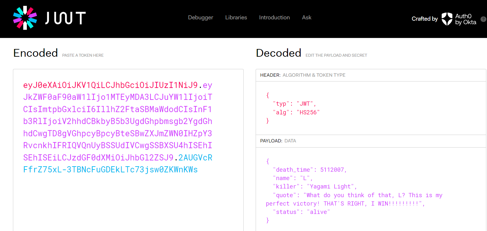
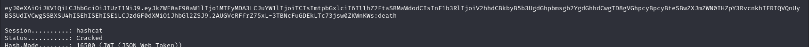
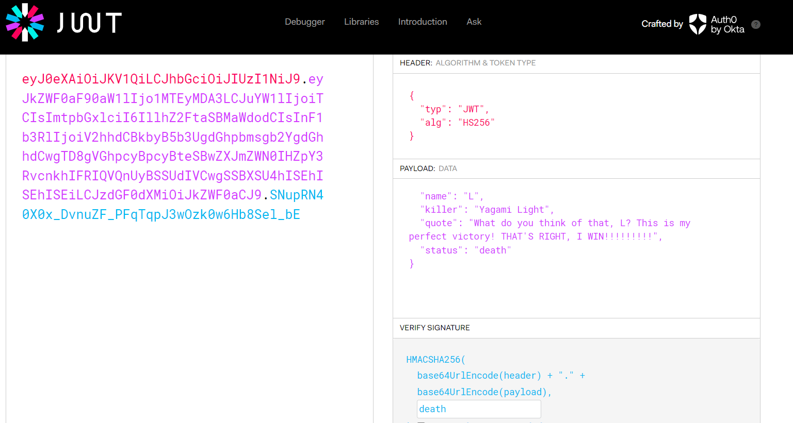
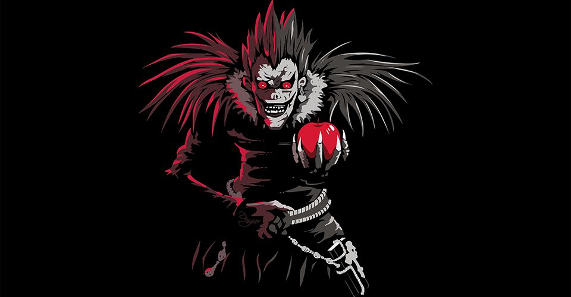

# C1 - Death Token Challange

In this challenge, we are tasked with correcting false data in a JWT token. When we paste the token into jwt.io, we can see it contains information related to characters from the Death Note series:

First, we cracked the JWT token using the following command:

`hashcat -a 0 -m 16500 jwt.txt rockyou.txt`

As we can see, the key is "death". Now, addressing the false data issue—without even knowing the plot, we can spot something suspicious. The name of the character is "L", there is a killer named "Yagami Light", but the status says "alive"? That seems odd. A quick search confirms that Yagami indeed killed L. So, what we need to change in the payload is the status. We update "alive" to "death" (which makes sense, given the key is "death" too):

And with that, we’ve created the correct token that Ryuk was after. He’s satisfied now, and he’s letting you go… or are you his next source of entertainment?

