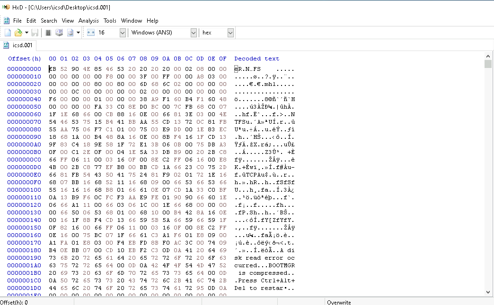

# C10 - Shadows Possession Jutsu:

When we start the machine, we notice several tools and a file available:

- **AccessData FTK Imager**: This tool is used for both acquiring and analyzing image files.
- **HxD**: A tool designed for editing a file's bytes.
- **icsd.001**: Upon examining the headers, we can identify that this is an NTFS file system image.

However, when we attempt to open the file in FTK Imager, it shows as an unrecognized file system. This could be caused by corrupted header and footer bytes.

Therefore, we open the file again in HxD and look for header and footer bytes. 

When investigating the header and footer bytes for NTFS file system we see that it should be like this:

- **Bytes 0x03–0x0A**: Signature "NTFS".
- Last 2 bytes of MBR (first sector of NTFS) should be 55 AA.

After correcting these bytes with HxD, FTK Imager can identify and analyze the file system. 
[4] 85 → 54, 

[510-511] 22 55 → 55 AA

After examining the recycle bin and the user desktop, we discovered a **password** and a **ZIP file**. The first assumption is that the password might be used to unlock the ZIP file.

Content of the pw.txt is “hello123”

And there is a txt file in the found zip file

Let us extract and read the file with the winrar to be able to provide password. 

The answer of the first question is the “U2hpbWlzaGFv”. 

1. Question is “What malware is used for persistence?”. 

Lets look at registries for autorun. 

We need to look at “Computer\HKEY_CURRENT_USER\Software\Microsoft\Windows\CurrentVersion\Run”

In order to find that key we need to extract “C:\Users\icsd\ntuser.dat*” files. 

After viewing that registry with “Registry Editor” we find the naswer is “gh0st.exe”

1. What is the name of the flash disk used to install the malware? 

In order to find the inserted flash disks we need to look for 

“Computer\HKEY_LOCAL_MACHINE\SYSTEM\CurrentControlSet001\Enum\USBSTOR”

registry. 

We need to extract “C:\Windows\system32\config\SYSTEM*” files for that. 

Answer is “SanDisk”

To Sum Up

Questions:

1. What is the content of the data.zip? “U2hpbWlzaGFv”
2. What malware is used for persistence? “gh0st.exe”
3. What is the name of the flash disk used to install the malware? “sandisk”