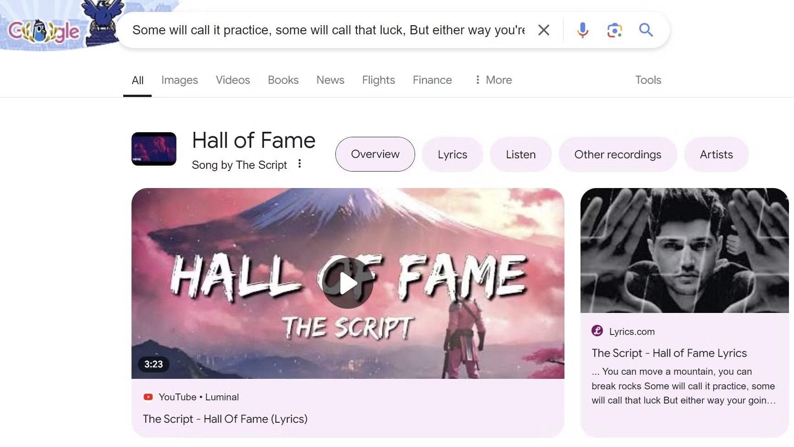
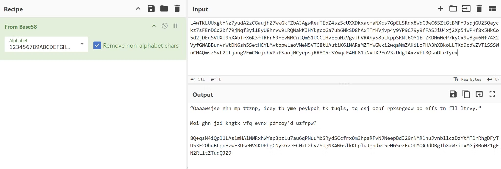
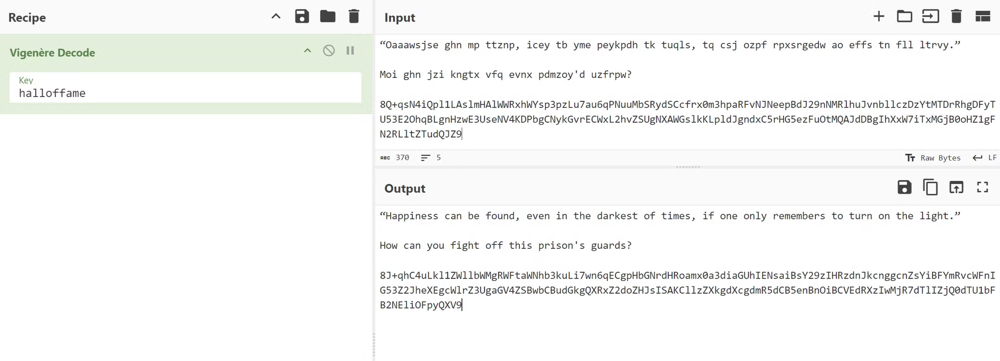
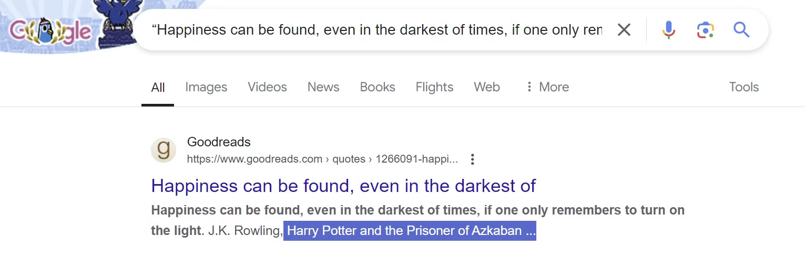
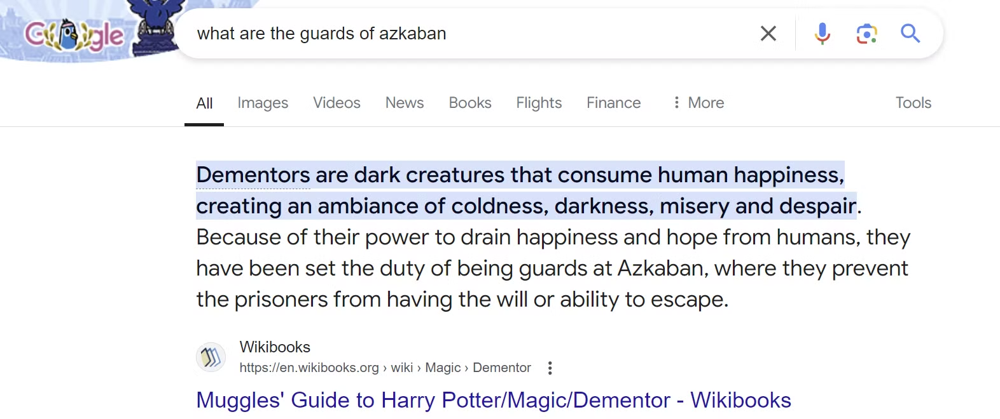
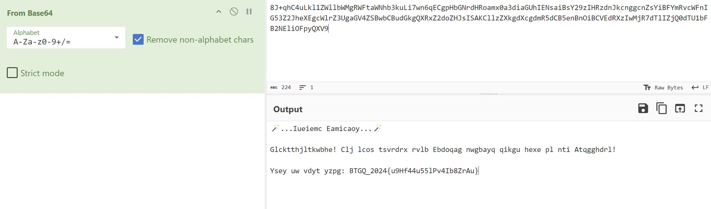
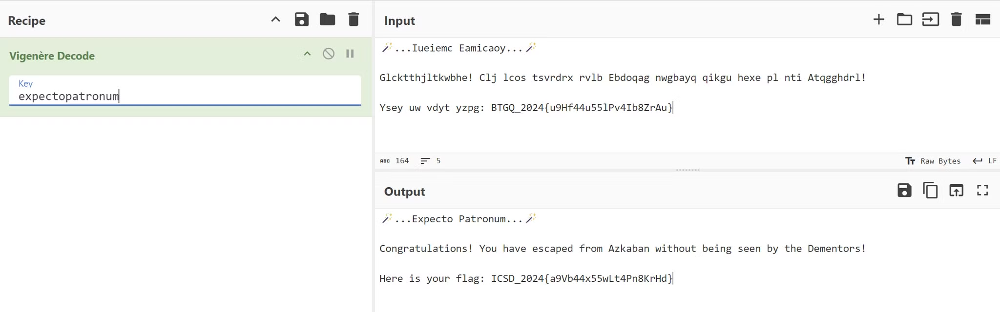

# Solution

First of all, we need to search for the song lyrics given in the task. It’s the song called **Hall of Fame** by The Script:

The secret message given to us is Base58 encoded value:

It looks like a cipher. As we are given a song that can be used for some purposes, we can guess that the ciphertext is a result of the Vigenere cipher. 

***But what is the key?*** 

Let’s try the song name - “**halloffame**” - and see the result:

Yes, it is the right key! We are given another message:

**“Happiness can be found, even in the darkest of times, if one only remembers to turn on the light.”**

**How can you fight off this prison's guards?**

The first quote is from the “Harry Potter and The Prisoner of Azkaban”, which can be found with a little Google search:

As we can guess, the Azkaban is a prison name. So we need to conduct another search to find out how we can fight off the guards of this prison? 

The guards of Azkaban are called **Dementors**:

We can fight off Dementors with…

The Patronus Charm! Good. We collected some information, so let’s analyze the secret message. It is another Base64-encoded value:

Well, it does not work. We have to look for another way. 

However, searching for the Patronus charm in Google would give something juicy:

Let’s raise the wands and say the magic words:

The spell worked! Challenge solved! 🪄🪄🪄

Flag: **`ICSD_2024{a9Vb44x55wLt4Pn8KrHd}`**