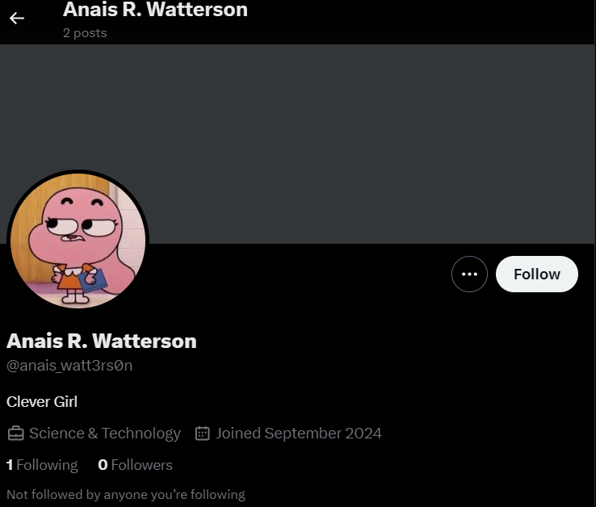
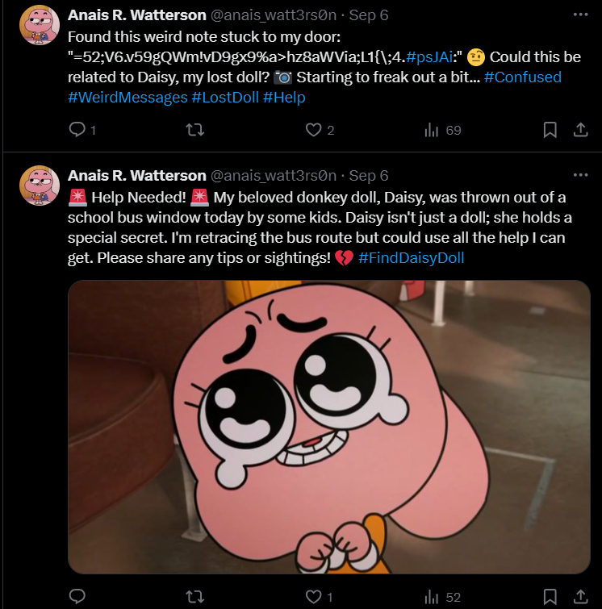
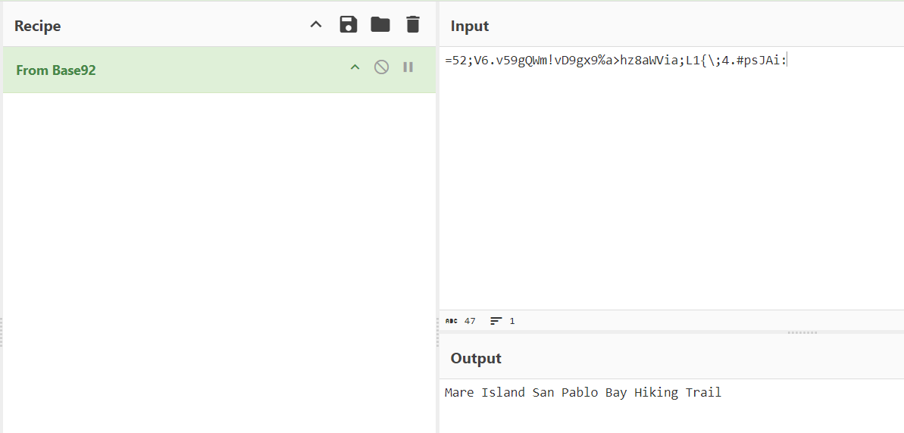
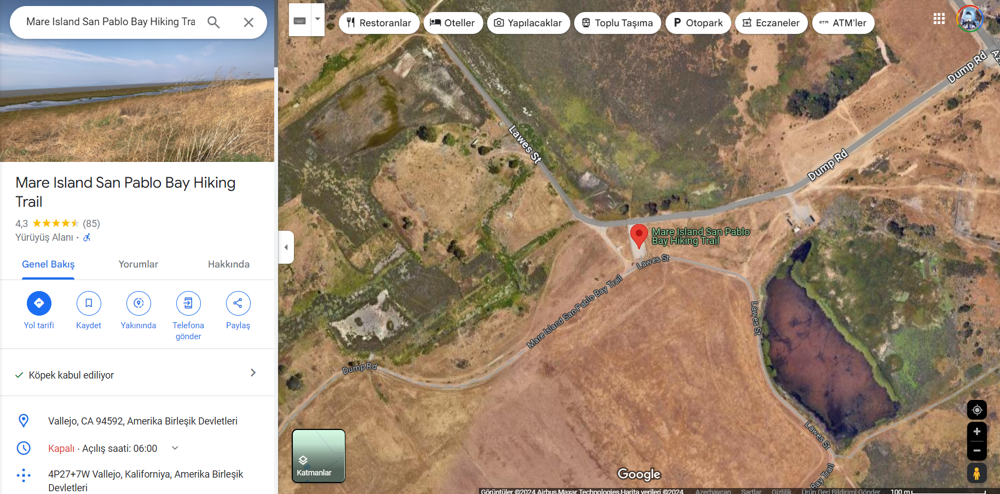
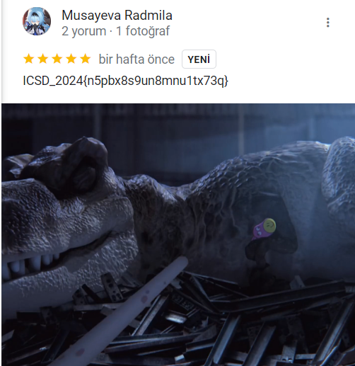

# C3 - ANAIS_WATT3RS0N 

Here we see that in the description it's mentioned that Anais created a Twitter account and name of the challange looks like a challange name. We search it on Twitter (R.I.P.), and we see an account:

Browsing through it, we noticed that Anais first asked for help, and later found some strange, unreadable text stuck to her door:

From its format, we suspected it might be encoded in one of the Base encoding types, so we used CyberChef (https://gchq.github.io/CyberChef/) to decode it:

Voilà! We finally cracked it. It revealed the name of a location: Mare Island San Pablo Bay Hiking Trail. We searched for it on Google Maps:

Usually, in these kinds of puzzles, we find interesting clues in the comments section, so we looked there (sorted by newest):

That's when we discovered that Tina, the fearsome bully of Elmore Junior High, had taken Anais's doll. But did you know Tina did it because she couldn't sleep at night? Now you know both the flag and the reason behind her actions.