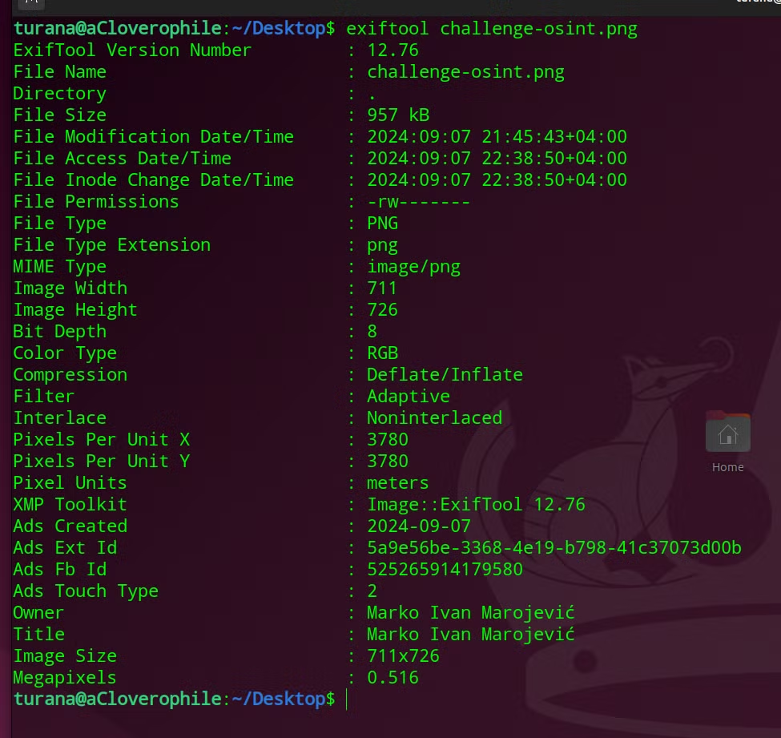
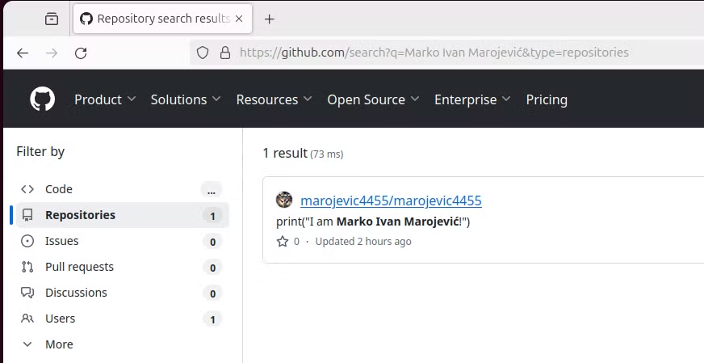
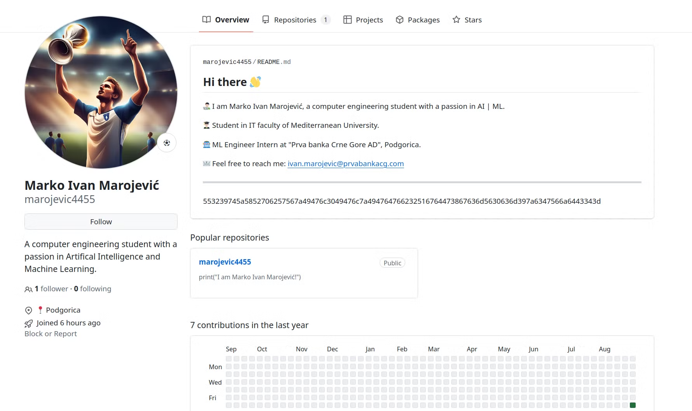
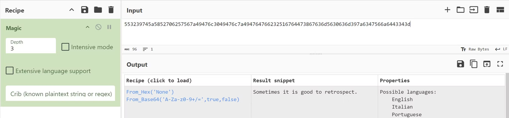
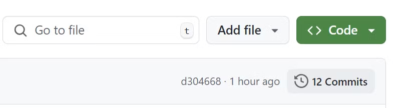
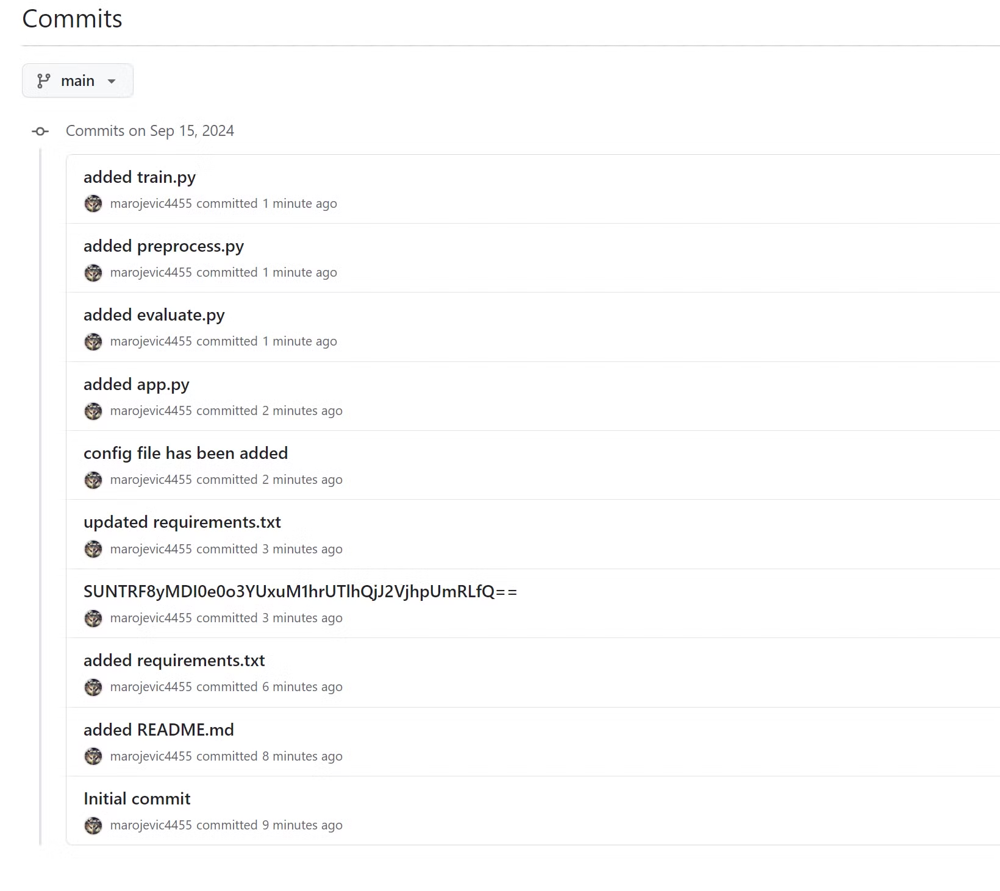
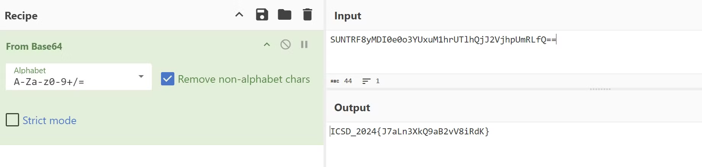

# Solution

**Question 1.** Who is the owner of this picture?

To find out this information, extracting the exif data of this picture is enough:

**ANSWER**: **Marko Ivan Marojević** 

---

**Question 2.** What is the email address of him? 

By analyzing the picture attentively, the GitHub logo can be easily noticed. So we have to search for Marko Ivan in the GitHub. 

Searching for **Marko Ivan Marojević** in the GitHub:

GitHub profile of Marko Ivan:

In the greeting page, we can easily collect information such as where he is studying, where he is working, how to contact him. 

**ANSWER**: **ivan.marojevic@prvabankacg.com**

---

**Question 3.** Which country is he living in? 

We can see that Marko is an intern at “Prva banka Crne Gore AD”, in Podgorica. Podgorica is the capital city of Montenegro.

**ANSWER**: **Montenegro**

---

**Question 4.** Find the flag. 

There is a repository in Marko’s profile:

And the note left in the main page of Marko is this:

***Sometimes it is good to retrospect…*** It means that we should look into something history-related. 

***Maybe a commit history?***

Clicking on the **Commits** link gives us the commit history:

The Base64-encoded value:

**ANSWER**: **`ICSD_2024{J7aLn3XkQ9aB2vV8iRdK}`**

