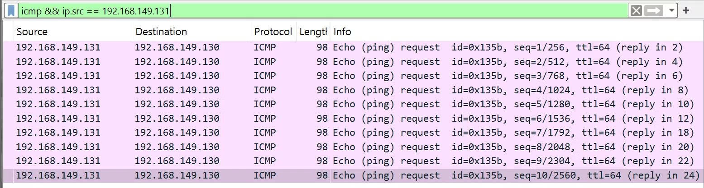
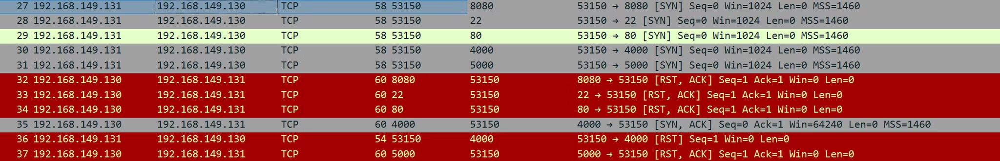
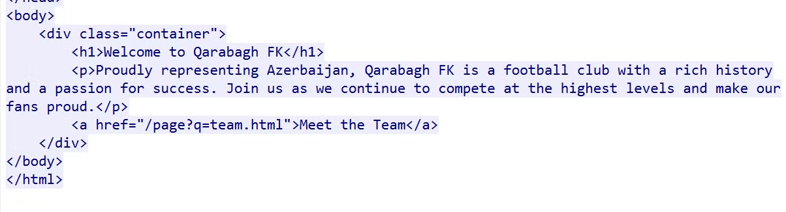
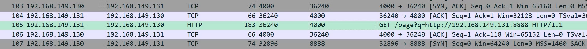
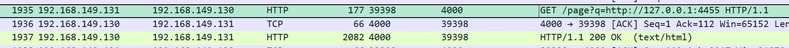
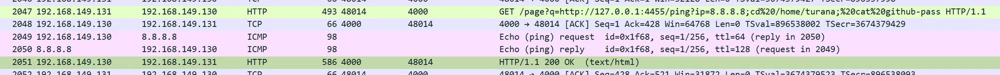
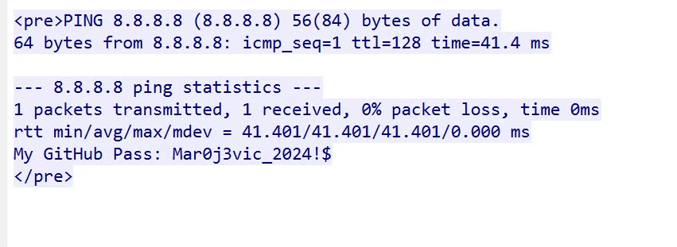

# Solution

- **Question 1.** How many ICMP Echo requests were sent to the target initially?
    - Filter: **`icmp && ip.src == 192.168.149.131`**

- ANSWER: **`10`**

---

- **Question 2.** Which ports were scanned by the attacker? (Answer format: **port1,port2**, etc. ***in the ascending order***)
    - Packets number from **27** to **37** is an indicator of a port scan.

    

    - According to the packets with SYN flag sent by source IP address, 192.168.149.131, we can determine which ports were scanned.

- ANSWER: **`22,80,4000,5000,8080`**

---

- **Question 3.** Which port was open?
    - As seen from the port scan capture, port **`4000`** responded with a packet of **`[SYN,ACK]`** flag. The attacker host then sent a TCP packet with a **`RST`** flag and terminates the connection, because it determined that it was open.

- ANSWER: **`4000`**

---

- **Question 4.** Which football club’s website was hosted on that port?
    - Following HTTP stream from packet number 61 is enough to determine:

- ANSWER: **`Qarabagh`**

---

- **Question 5.** Which port did the attacker host an HTTP server?
    - The packet number 105 shows us the request made to the attacker’s HTTP server, which was hosted on port 8888.

- ANSWER: **`8888`**

---

- **Question 6.** Which attack did the attacker try to conduct? (***Full name, please.***)
    - The attacker tried to fetch unauthorized resources by making the requests on behalf of the server, meaning that they tried to conduct a **Server-Side Request Forgery** attack.

- ANSWER: **`Server-Side Request Forgery`**

---

- **Question 7.** Which port hosted an internal application?
    - The request made to the port **4455** of the localhost was successful:

- ANSWER: **`4455`**

---

- **Question 8.** What is the name of the file containing sensitive information?
    - The attacker made a request by exploiting a command injection vulnerability in the internal application to read the contents of the file called **`github-pass`**:

- ANSWER: **`github-pass`**

---

- **Question 9**. What is the password?
    - Following the HTTP stream for packet number 2051:

- ANSWER: **`Mar0j3vic_2024!$`**