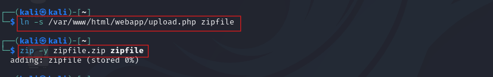

    
### **Exorcising Sukuna’s Curse**
    


---

## CONNECTION

Let’s start the machine and connect with OpenVPN.

```bash
sudo openvpn prolab-user_1.ovpn
```


---

## ENUMERATION

- NMAP SCAN

```bash
nmap -sC -sV -p- --min-rate 5000 10.20.17.70
```


An initial Nmap scan reveals two open ports. On port 21 `FTP`, and on port 22 `SSH` service is running. The Nmap script result indicates that Anonymous login for FTP is allowed. Now, we can continue enumeration process with FTP.

- FTP LOGIN

```bash
ftp 10.20.17.70
```


Only one .txt file exists on FTP server (system_log.txt). In order to read it, firstly, we exchange to `binary` mode and download the file to our machine with `get` command.

```bash
ftp> binary
ftp> get system_log.txt
ftp> exit
```


We’ve received a hint from the file: the probable username is 'user1', and the SSH service, since it’s open, will be a target for a potential brute-force attack. We can move on to the next stage. 

---

## EXPLOITATION & INITIAL FOOTHOLD

- SSH BRUTE-FORCE

```bash
hydra -l user1 -P rockyou.txt 10.20.17.70 ssh
```


Soon, we successfully cracked the user's password and gained an initial foothold on the machine using SSH credentials. 


---

## PRIVILEGE ESCALATION ( HORIZONTAL )

The first flag we should get is located on `/home/user2/user.txt.` 

That is a user on the machine to which we need to escalate our privileges. 

```bash
cat /etc/passwd
```


Besides user2, the presence of another user  `www-data` shows that a web application is likely running on the machine.

We will view running processes in order to determine the listening port for web server  and /var/www/html folder to know the exact location for web application. 

```bash
netstat -tulpn
```


We don’t have permission for webapp folder. Port 9090 is commonly used as an alternative HTTP port for web servers. It is running on local machine: `127.0.0.1:9090`. That’s why we can’t access it from our machine. To achieve this, we need to set up port forwarding.

```bash
ssh -L 127.0.0.1:4444:127.0.0.1:9090 user1@10.20.17.70
```


Explaining the commands: 

- `ssh -L` - used in local ssh port forwarding.
- `127.0.0.1:4444` - is our local machine ip and port (port is optional).
- `127.0.0.1:9090` - is remote machine ip and port in which web server is running.
- `user1@10.20.17.70` - needed ssh credentials to connect.

Once the set up is complete, we can open a web browser and access the web server at `http://127.0.0.1:4444` .


It appears that the Apache web server is running on the machine, with directory listing enabled. Let’s take a closer look at the script files.


`/uploads`

Directory is empty. 


`upload.php`

Another hint suggests that we should look into the source code of upload.php. However, it currently does not reveal any useful information.


`doc.php`

This php script is intended to upload files to the remote machine. Let’s take advantage of it.

We aim to understand the functionality of the script, that is why we upload a random file and observe that it only accepts ZIP files.


There are many ways to exploit vulnerabilities with ZIP files, but our goal is to examine `upload.php`. Therefore, we will use a symlink to access the contents of the file. 

- Create and store symlinks in ZIP files:

```bash
ln -s /var/www/html/webapp/upload.php zipfile  #Make symlink to the exact location of upload.php.
zip -y zipfile.zip zipfile #Create symlinked ZIP file.
```




A folder is created for ZIP file and uploaded to the `/uploads` directory.


The symlink was extracted from the ZIP file, and upon clicking it, we can now view the source code of `upload.php`


The script contains a message directing us to access the `/.pro_hidden_connectivity` folder.


Here is another php script, named `rce.php` is for the Remote Code Execution. 


Before we proceed, we should initiate a netcat listener.


We have entered a suitable one-liner command for a reverse shell.


It results in an error during code execution. 
The reason for this is clearly indicated in the script: `window.btoa`, which is used to encode a string in Base64 format.


Let’s encode the command to base64 format and execute it again. As a result, we have got a reverse shell from user2 and received our first flag.


                  


---

# PRIVILEGE ESCALATION (ROOT)

After having the shell from “user2”, now run the `linpeas.sh` for finding potential privilege escalation. 

Then we found logrotate in `/etc/cron.d`:


Additionally, there is a writable path for escalation that `linpeas.sh` shows.


When we look at the logrotate configuration files, we found an interesting configuration file called as “blackmirror”.


After reading this configuration file, we realized the file path is vulnerable : 

```bash
/usr/local/bin/postrotate.sh
```


Since `postrotate.sh` is writable by all users (due to `777` permissions), we modify it to include a command that will allow privilege escalation. Here’s how:

- Overwrite `postrotate.sh` with a payload that creates a setuid shell:

Explanation of malicious script:

- `#!/bin/bash`: Specifies that the script should run with Bash.
- `cp /bin/bash /tmp/bash`: Copies the system’s `bash` executable to `/tmp`.
- `chmod +s /tmp/bash`: Sets the setuid permission, allowing the shell to execute with the privileges of the file owner (root).

Now we are root!!!

