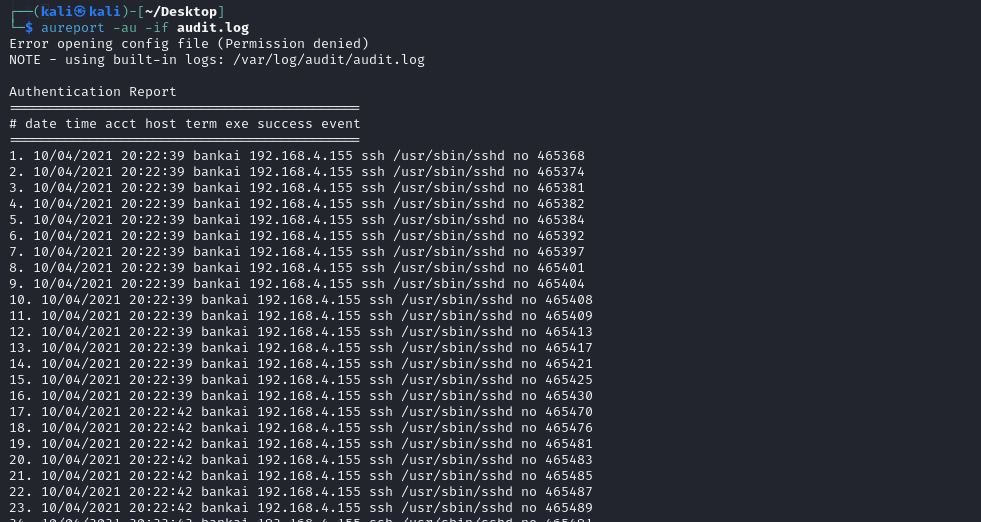
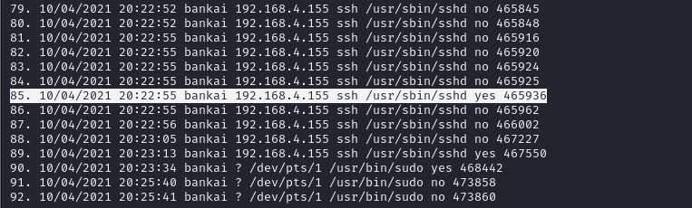
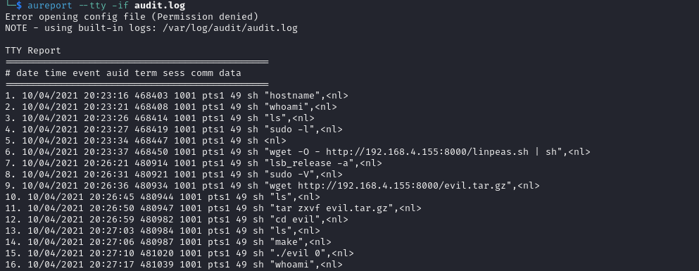
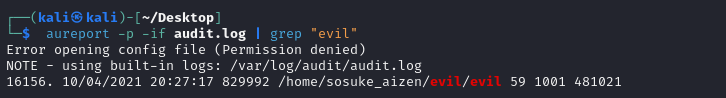
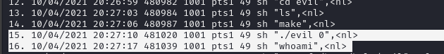
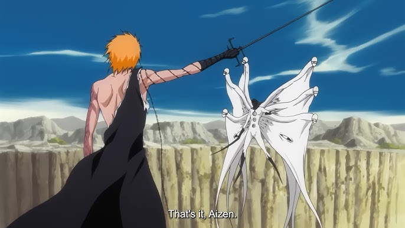

# C7 - Root Reaper Quest 

In this challenge, we are given a log file and tasked with performing a threat-hunting process. To work with this file, we can use tools like Notepad or Visual Studio Code or auditd. You can install it using the command below:

`sudo apt install auditd`

Once installed, we can start examining the file. A good starting point is using the `--summary` option to get an overall understanding of the file:

From the output, we can see that the account "bankai" was compromised. Our goal is to identify the type of attack that was used to gain initial access. Analyzing the results of the previous command, we notice that within a span of 1 second, there were almost 16 authentication attempts. This is a clear indication of a brute-force attack. The attacker got lucky, as we can see a successful attempt in the output.
Seventeen seconds later, they used the compromised username and password to log in and successfully gained a pseudo-terminal.

Next, we need to analyze the attacker’s actions after gaining access. The first thing that likely comes to mind is that the attacker performed system enumeration. To investigate this, we can use the `--tty` parameter to generate a report on the tty keystrokes.
As shown in the screenshot below, the attacker ran several commands: 
- `hostname` to retrieve the DNS name and set the system’s hostname or NIS domain name
- `whoami` to display the username of the current user, and ls to list the contents of the current directory.
- `wget` to download the linepeas script from their own machine, which was hosted on port 8000.
(*LinPEAS is a script that search for possible paths to escalate privileges on*)

Now we need to determine the name of the binary that the attacker used to gain root access. This will give us the crucial piece of information required to finish this challenge: the PID responsible for it.

Following the output from the previous command, we saw that the attacker executed the `lsb_release -a` command, which provides information about the Linux Standard Base (LSB) and distribution-specific details. After that, the attacker ran the `sudo -V` command, which prints the sudo version string, along with the version string of the security policy plugin and any I/O plugins. If the user invoking this command is already root, it will display the arguments passed to configure when sudo was built, and plugins may show more verbose information such as default options.

Five seconds after determining the sudo version, the attacker downloaded a compressed file to the target machine, which was still hosted on their own server. They ran the `ls` command to confirm the successful download, extracted the contents, navigated to the extracted directory, and ran the `make` command to build it.

At this point, we can infer that there might be a description file within the extracted directory. Once the build process was complete, the attacker executed a binary called evil.

To proceed, we can use the -p parameter to list all process IDs (PIDs). Since we're particularly interested in anything related to the "evil" binary, we will use the `grep` command to filter out unnecessary information.

The result we get is:

We can see that the PID of the binary is *829992*, running from the */home/sosuke_aizen/evil/evil* path at 20:27:17. Additionally, we can observe that the attacker executed the evil file using `./evil` and then verified if they had gained root access by running the `whoami` command.

It seems even the mighty Sōsuke Aizen, the genius who once transcended the boundaries of Shinigami and Hollow, was outwitted in the cyber realm. How the tables have turned! Is this mysterious hacker the next Ichigo Kurosaki? In this digital battle, the lines between the real world and the spiritual realm blur, leaving us to wonder—has Aizen found his true match in this realm?

Only the Soul King knows.

