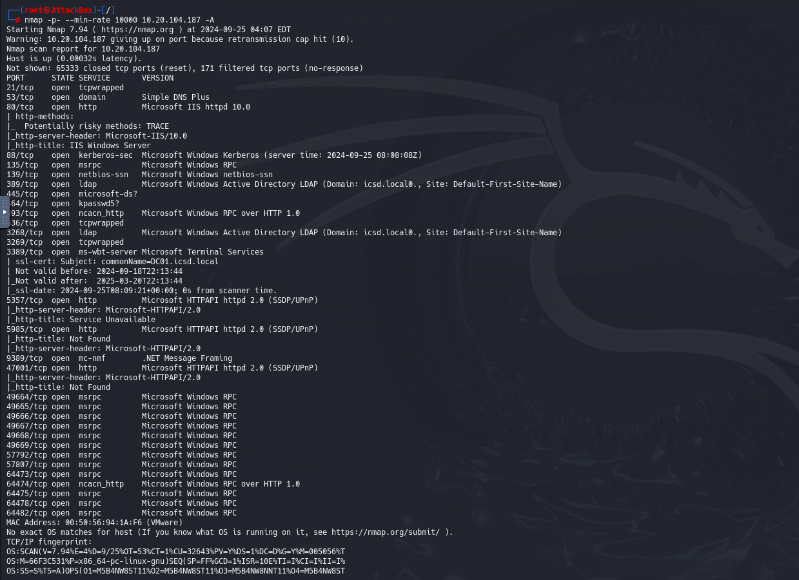

# C9 - End of Rumbling

In the task need to get hidden flags during the attack. First we did an nmap scan:



It seems the machine is domain controller and it is inside `icsd.local` domain. Through the hint, it seems `armin.arlert` is a domain user. Nmap has krb5-enum-users.nse script that can help us to discover potential valid users.


Checking through impacket’s get np users, we can see that this user is ASREP roastable. After cracking this user’s hash, the password ocean is obtained.


Let’s search for all AD users using `crackmapexec` tool and create a list for them.


It seems the user Connie has the password ‘Br4tSumm3r’. According to Connie’s description, it is obvious that the user Jean has the same problem. Password spraying gives us that Jean has the same password as Connie.


Jean user has read access to “Secret Mission” share. This share contains credentials for the user levi.


Let’s use BloodHound:


we analized executable with ghidra and there was encoded credential


Upon analyzing the data with BloodHound, we identified that Levi has **ForceChangePassword** delegation over **Zeke**. This means Levi can change Zeke’s password without knowing the current one.


We used this delegation privilege to change Zeke's password and log in as him.


Interestingly, Zeke had **GenericAll** privileges over **Reiner**, which allowed us to change Reiner's password as well. This opened up further access to the system.


so we again used it to change password.


Further investigation into history data revealed that **Mikasa's** password had been leaked. Using her credentials, we gained access and found a **pcap** file, which we promptly downloaded for analysis.


When we login as Mikasa, we found a pcap file. We download this pcap file.


We started to analyze the file by tshark


The analysis revealed several keyboard events, which, when decoded, provided **Eren's** password. This discovery was crucial as Eren's credentials would lead us closer to the final objective.

[https://gist.github.com/MightyPork/6da26e382a7ad91b5496ee55fdc73db2](https://gist.github.com/MightyPork/6da26e382a7ad91b5496ee55fdc73db2)


We decoded the following keypress events to uncover the password:

```jsx
0000130000000000 -> 0x13 -> p
0000040000000000 -> 0x04 -> a
0000160000000000 -> 0x16 -> s
0000160000000000 -> 0x16 -> s
00002c0000000000 -> 0x2C -> (SPACE)
00000c0000000000 -> 0x0C -> i
0000160000000000 -> 0x16 -> s
00002c0000000000 -> 0x2C -> (SPACE)
0000170000000000 -> 0x17 -> t
0000210000000000 -> 0x21 -> 4
0000170000000000 -> 0x17 -> t
0000210000000000 -> 0x21 -> 4
00000e0000000000 -> 0x0E -> k
0000210000000000 -> 0x21 -> 4
0000200000000000 -> 0x20 -> 3
0000370000000000 -> 0x37 -> .
0000280000000000 -> 0x28 -> (ENTER)
```

We used **impacket** to dump the NTLM hashes.


Finally, using the administrator’s credentials, we logged into the system and completed the final task.

